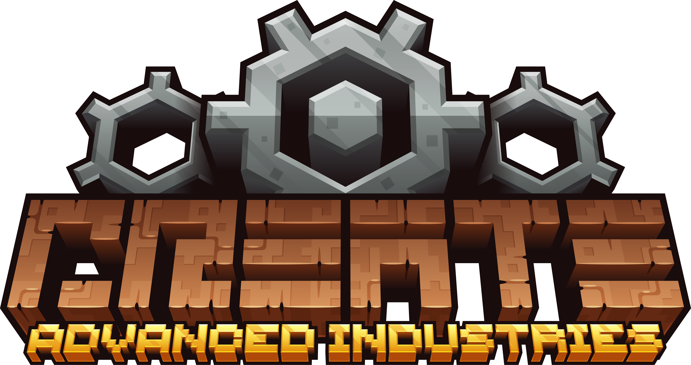

<p align="center">
  
</p>

## Preface

If you enjoyed Create: Above and Beyond, Create: Astral, Create: Arcane
Engineering then you'll probably enjoy this pack.

As a Factorio player, there were many elements of those packs that I absolutely
loved and I wanted to design my own. I stand on the shoulders of giants and
this would absolutely not exist without the amazing work they've done to inspire
me.


## Summary

There are 8 chapters of quest progression, in which each chapter unlocks a
mechanism which gates higher tier technology. Everything has been balanced to
work primarily around Create and its addons.


## Contributing

GitHub repository structure is intended for use with the Prism Launcher, and
uses [Pakku](https://github.com/juraj-hrivnak/Pakku) to sync the mods.
```bash
cd /path/to/prism/instances
mkdir -p cai/minecraft
git clone git@github.com:omgimanerd/create-advanced-industries cai/minecraft
cat <<EOF > cai/instance.cfg
[General]
ConfigVersion=1.2
ManagedPack=true
iconKey=icon
name=Create: Advanced Industries
EOF
cd cai/minecraft
pakku fetch
```
There are also scripts in the `kubejs/` directory that will need to be installed
with [kjspkg](https://github.com/Modern-Modpacks/kjspkg).


## Author(s)
  - omgimanerd

## Contributors
  - bleepbloopsify, for playtesting and patching occasional bugs
  - nyagibyte, for textures
  - tiptox, for the pack logo
  - RPorotos, for many of the custom textures

## License
  - [Mozilla Public License 2.0](LICENSE)
